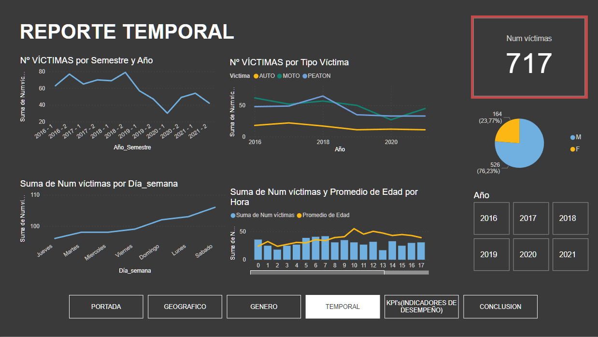
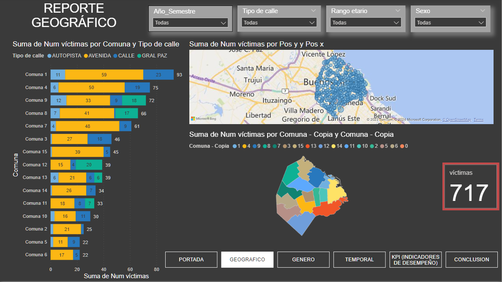
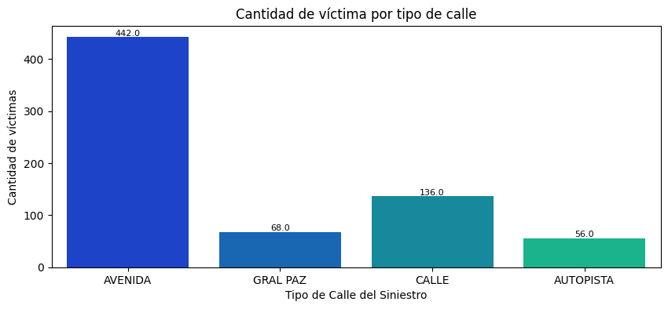
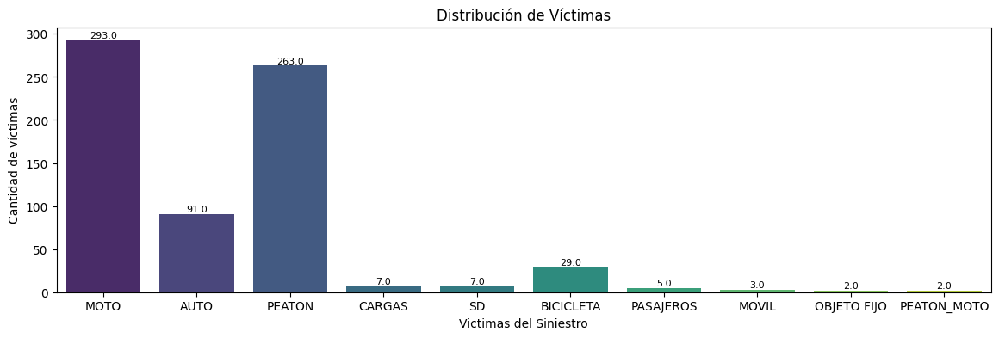
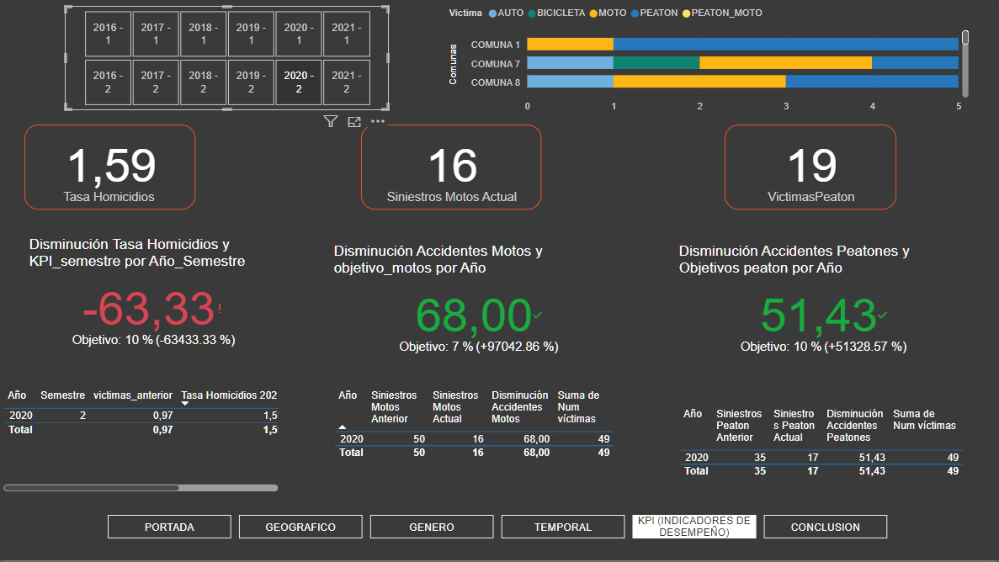

## **Proyecto Individual** - 02-Siniestros Viales en CABA con víctimas fatales -(2016-2021)

## Índice

1. [Introducción](#introducción)
2. [Contexto](#contexto)
3. [Desarrollo](#desarrollo)
   1. [Datos](#datos)
   2. [Análisis de Datos](#análisis-de-datos)
      - [Análisis Temporal](#análisis-temporal)
      - [Análisis Geográfico](#análisis-geográfico)
      - [Análisis Participativo](#análisis-participativo)
   3. [Indicadores de Rendimiento Clave KPI](#indicadores-de-rendimiento-clave-kpi)
4. [Conclusiones](#conclusiones)

### **Introducción** ⚠️ 🚧

Este proyecto, ejecutado como Data Analyst de una consultora, busca realizar un análisis de datos solicitado por el `Observatorio de Movilidad y Seguridad Vial (OMSV)`, dependiente de la Secretaría de Transporte del Gobierno de la Ciudad Autónoma de Buenos Aires (CABA). El objetivo principal es proporcionar información fundamentada para la toma de decisiones orientadas a prevenir y reducir siniestros viales con víctimas fatales en la Ciudad de Buenos Aires.

### **Contexto** ⚠️ 🚧

Los siniestros viales, eventos que involucran vehículos en las vías públicas, son una preocupación crítica en términos de seguridad vial. Reducir las tasas de mortalidad asociadas a estos incidentes es crucial para salvaguardar la vida de las personas en la ciudad.

Se utilizaron datos públicos del periodo 2016-2021, accesibles en la página oficial de CABA: [Datos oficiales](https://data.buenosaires.gob.ar/dataset/victimas-siniestros-viales).

### **Desarrollo** ⚠️ 🚧

#### Datos ⛔

Se empleó la **Base de Víctimas Fatales en Siniestros Viales**, en formato Excel, con dos pestañas: `HECHOS` y `VICTIMAS`. Estos datos fueron extraídos, limpiados y cargados mediante el proceso de ETL (Extracción, limpieza y carga de datos) utilizando Pandas y Jupyter Notebook. El resultado se encuentra en el archivo `siniestros_limpio_2.csv`.

#### Análisis de Datos ⛔

- Se examinaron las variables numéricas del dataset y se evaluó su correlación mediante una matriz, identificando una relación positiva entre las variables `Edad` y `Hora`.
- La mayoría de los siniestros resultaron en una víctima fatal, siendo raro involucrar a 3 víctimas.

# ``Análisis Temporal:``

En el periodo analizado (2016-2021), los siniestros viales con víctimas fatales mostraron una tendencia alta y estacionaria hasta 2018, seguida por una disminución (considerando el inicio de la Pandemia por COVID19 en 2020), que luego ascienden nuevamente para el 2021.

Los horarios críticos están relacionados con el ingreso a la jornada laboral (5-9h), almuerzo (12-14h) y salida del trabajo (17-18h), mientras que los fines de semana se asocian con salidas nocturnas (4-7h).

Edad de las víctimas: La distribución del rango etario muestra que para los `Masculinos` es de 20 a 40 años, mientras que para las `Femeninas` es de 40, 60 y 80 años.

# ``Análisis Geográfico:``

Los siniestros ocurren en un 62% en calles tipo `Avenida`. Este patrón se repite a lo largo de los años. Las comunas con más siniestros son: 1, 4, 9 y 8.

# ``Análisis Participativo:``

Se analizaron las víctimas, predominantemente en los roles de **Conductor** o **Peatón**, y los siniestros se producen mayormente en Motos, seguidos por Peatones.

#### Indicadores de Rendimiento Clave KPI ⛔

# ``KPI Propuestos``

1. **Reducir en un 10% la tasa de homicidios en siniestros viales de los últimos seis meses, en CABA, en comparación con la tasa de homicidios en siniestros viales del semestre anterior**

   Tasa de Homicidios en Siniestros = (Número de homicidios en siniestros viales / Población total) * 100,000

2. **Reducir en un 7% la cantidad de accidentes mortales de motociclistas en el último año, en CABA, respecto al año anterior**

   Cantidad de Accidentes Mortales en Moto = (Número de accidentes mortales en moto en el año anterior - Número de accidentes mortales en moto en el año actual) / (Número de accidentes mortales en moto en el año anterior) * 100

3. **Reducir en un 10% la cantidad de accidentes con víctimas fatales de peatones en el último año, en CABA, respecto al año anterior**

   Cantidad de Accidentes Mortales Peaton = (Número de accidentes mortales con víctimas peatón en el año anterior - Número de accidentes mortales con víctimas peatón en el año actual) / (Número de accidentes mortales con víctimas peatón en el año anterior) * 100

### **Conclusiones** ⚠️ 🚧

Tras un análisis exhaustivo de los datos y su visualización a través de un dashboard en PowerBi, se concluye que las víctimas fatales por siniestros de tránsito entre 2016 y 2021 fueron 717 personas. La franja horaria de mayor problemática es durante el ingreso laboral (5-9h), almuerzo (12-14h), y regreso a casa (17-18h). En los fines de semana (Sábado y Domingo), los accidentes se manifiestan en horarios de salidas nocturnas (3-7h). Las víctimas son en un 76% masculinas, principalmente en el rango etario de 20-40 años.

Se observa la necesidad de mejorar señales y controles en Avenidas, especialmente en las comunas 1 y 4 de CABA. Se sugiere la implementación de campañas de prevención dirigidas a hombres de 20 a 40 años, así como a motociclistas.

# `[MARIANO POPOV DATA PT-05]`
